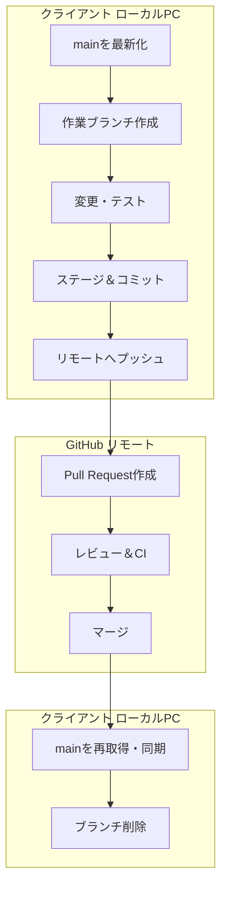
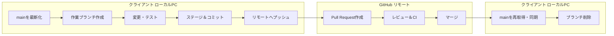

こちらが、GitHub Flowの1サイクルを図解した教材用イメージです。クライアント側（ローカルPC）とGitHub側（リモート）で行う作業を明確に分け、各ステップに対応するコマンドも併記しています。若手教育やチーム標準化に活用いただけます。
# GitHub Flowの1サイクル（Mermaid図解＋例示コマンド）

短いブランチで素早く改善し、PRレビューで品質を担保する軽量フローです。クライアント側（ローカル）とGitHub側（リモート）の役割を分けて図解し、各工程のコマンドも併記します。

---

## 図解（Mermaid）



---

## 工程ごとの例示コマンドとポイント

### 1. mainを最新化（開始前の同期）
```bash
git checkout main
git pull origin main
```
- **目的:** 最新の本番状態を基点に作業開始。コンフリクトの予防。

### 2. 作業ブランチ作成（小さく短命）
```bash
git checkout -b feature/user-profile-edit
```
- **命名例:**  
  - **feature/…:** 新機能  
  - **fix/…:** バグ修正  
  - **refactor/…:** リファクタ  
- **ポイント:** 1PRでレビュー可能な粒度に限定。

### 3. 変更・ローカルテスト（動くものを積み上げる）
- **作業:** 実装、ユニットテスト、Lint、ローカル起動確認。  
- **ポイント:** 動作する最小差分を作る。

### 4. ステージ＆コミット（こまめに意味単位）
```bash
git add .
git commit -m "Add: ユーザープロフィール編集フォーム追加"
```
- **メッセージ例:**  
  - **Add:** 追加  
  - **Fix:** 修正  
  - **Update:** 変更  
  - **Refactor:** リファクタ  
- **ポイント:** レビューしやすいコミット粒度。

### 5. リモートへプッシュ（PR準備）
```bash
git push origin feature/user-profile-edit
```
- **ポイント:** 初回プッシュでGitHubにブランチが作成され、PR作成が可能に。

### 6. Pull Request作成（情報を十分に）
- **PR記述:**  
  - **概要:** 何を、なぜ  
  - **変更点:** 箇条書き  
  - **テスト:** 実施内容・スクショ・動画  
  - **影響範囲:** UI/DB/API等  
  - **関連:** Issue番号、仕様書リンク  
- **ポイント:** レビュー観点が揃うよう、背景も簡潔に。

### 7. レビュー＆CI（品質担保）
- **対応:** コメント反映、追加コミットして再プッシュ
```bash
git add .
git commit -m "Fix: バリデーションエラー表示を修正"
git push origin feature/user-profile-edit
```
- **CI例:** テスト、Lint、ビルド、セキュリティチェック。失敗時は修正して再実行。

### 8. マージ（適切な戦略を選択）
- **GitHubで選択:**  
  - **Squash merge:** 1コミットにまとめて履歴を整理  
  - **Merge commit:** 個々のコミットを保持  
  - **Rebase and merge:** 線形履歴に整形（コンフリクト注意）  
- **ポイント:** チーム方針を標準化（DEV_STANDARD.mdに記載推奨）。

### 9. デプロイ（CI/CDがある場合）
- **自動:** mainへマージをトリガーに本番へ自動リリース。  
- **手動:** 承認付きデプロイや段階的リリースを採用することも有用。

### 10. mainを再取得・クリーンアップ
```bash
git checkout main
git pull origin main
git branch -d feature/user-profile-edit         # ローカル削除
# （任意）リモートブランチはPR画面からDelete branch
```
- **目的:** ローカル環境を最新に保ち、不要ブランチを整理。

---

## 役割整理（クライアントとGitHub）

- **クライアント側:**  
  - **最新化:** main取得  
  - **作業:** 実装・テスト・コミット  
  - **公開:** プッシュ、PR後の修正対応  
  - **同期:** マージ後にmain再取得、クリーンアップ

- **GitHub側:**  
  - **可視化:** 変更差分、PRのディスカッション  
  - **品質:** レビュー、CI、自動チェック  
  - **反映:** マージ、保護ルール（レビュー必須・CI成功必須）  
  - **配布:** 自動デプロイ（設定時）

---

## 若手向け最小チェックリスト（配布用）

- **開始:** main最新化  
- **作業:** ブランチ作成 → 実装 → テスト  
- **記録:** 意味単位でコミット  
- **公開:** プッシュ → PR作成（情報充実）  
- **品質:** レビュー＆CIを通す  
- **反映:** 既定のマージ方式でmainへ  
- **配布:** デプロイ（自動／手動）  
- **同期:** main再取得、ブランチ削除

---

必要なら、演習用に「PRテンプレート」「コミットメッセージ規約」「マージ戦略の標準」をセットで作ります。和文さんのDEV_STANDARD.mdに組み込める体裁でお渡しします。

📌 **図の見方**  
- 左側がローカルPCでの作業（Client）  
- 右側がGitHub上での操作（GitHub）  
- 各ステップは順番に矢印でつながっており、実際の開発フローを視覚的に理解できます  

もしこの図を **Mermaid記法で再現したい**、あるいは **教材用にPDF化したい** などのご希望があれば、すぐに対応できます！
